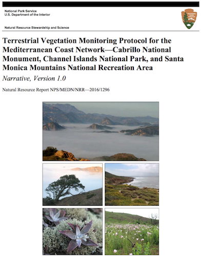
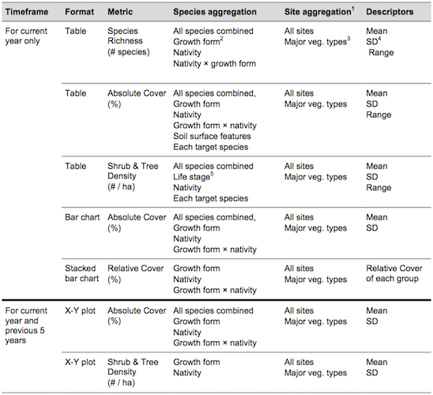

```{r setup, include=FALSE}
library(knitr)
opts_chunk$set(echo = F, message = F)

# rmarkdown::render("docs/index.Rmd", "all")
# uncomment for html_document
#opts_chunk$set(echo = T)

# TODO:
# - Parameterized Reports for `Year`,`Park`: https://rmarkdown.rstudio.com/developer_parameterized_reports.html
```

# Background

## Protocol Report

<div class="centered">

</div>

## Table 15. Data and summary statistics for annual report

<div class="centered">

</div>

## Appendix E: Template for Annual Terrestrial Vegetation Monitoring Report {.smaller}

<div class="columns-2">
**Figures**

- Figure E1. Map showing locations of sites monitored in 20XX at [PARK].
- Figure E2. Absolute foliar cover (%) of various plant groups observed during 20XX monitoring at [PARK].
- Figure E3. Relative plant cover by nativity in plant communities at [PARK] observed during 20XX monitoring.
- Figure E4. Relative plant cover by nativity and lifeform in plant communities at [PARK] observed during 20XX monitoring.
- Figure E5. Absolute foliar cover of all species and of all native species for each of the last 6 years of monitoring at [PARK].
- Figure E6. Density of native and non-native shrubs for each of the last 6 years of monitoring at [PARK].

**Tables**

- Table E1. Potential [PARK] monitoring sites that were visited and rejected in 20XX. Table E.2. [PARK] monitoring sites installed in 20XX.
- Table E3. [PARK] sites monitored in 20XX.
- Table E4. [PARK] sites scheduled for monitoring, but not monitored in 20XX. Table E.5. Burned sites monitored at [PARK] in 20XX.
- Table E6. Species richness (per transect) observed during 20XX monitoring of [PARK] vegetation.
</div>

# Examples

## Figure E1. Map of locations

```{r}
library(tidyverse)
library(leaflet)
library(mapview)
library(glue)
library(sf)

dir_tbl <- "~/Google Drive/projects/nps-ecoquants/data/tables_csv"

to_lonlat <- function(x, y, crs_str){
  st_as_sf(data_frame(x=x, y=y), crs=crs_str, coords = c("x", "y")) %>%
    st_transform(crs=4326) %>%
    st_coordinates()
}

locations <- read_csv(file.path(dir_tbl, "tbl_Locations.txt")) %>%
  mutate(
    # fix one location
    Y_Coord   = ifelse(Location_ID == 1502833764, B_Y_Coord, Y_Coord)) %>%
  # TODO: fix other locations
  filter(!is.na(X_Coord), !is.na(Y_Coord), !is.na(UTM_Zone)) %>%
  mutate(
    crs_str = glue("+proj={tolower(Coord_System)} +zone={UTM_Zone} +datum={Datum} +units={c(meters='m')[Coord_Units]}"),
    lon_lat = pmap(list(X_Coord, Y_Coord, crs_str), to_lonlat),
    lon     = map_dbl(lon_lat, ~.[,1]),
    lat     = map_dbl(lon_lat, ~.[,2])) %>%
  st_as_sf(coords = c("lon", "lat"), crs=4326)

mapView(locations)
```

## Figure E1. Map of locations - clustered

```{r}
leaflet(locations) %>%
  addProviderTiles(providers$Esri.OceanBasemap) %>%
  addMarkers(
    clusterOptions = markerClusterOptions(),
    popup = ~glue(
      "<b>Location_ID</b>: {Location_ID}<br>
      <b>Vegetation_Community</b>: {Vegetation_Community}<br>
      <b>Loc_Notes</b>: {Loc_Notes}"))
```

## Figure E2. Absolute foliar cover (%) - Static

```{r}
library(readxl)
library(here)

dir_qry         <- "~/Google Drive/projects/nps-ecoquants/data/CHISLandVegetationMonitoringDatabase/queries"
fig_codes_csv   <- here("data/figure_codes.csv")
q_xlsx          <- file.path(dir_qry, "qry-2016_fig-E2-absolute-cover.xlsx")
park            <- "CHIS"
year            <- 2016
veg_communities <- c("Coastal Sage Scrub", "Island Chaparral", "Valley/Foothill Grassland")

q <- readxl::read_excel(q_xlsx, na = c("", "NA")) %>%
  arrange(Park, SurveyYear, IslandCode, Vegetation_Community, FxnGroup, Nativity)
# View(q)
# table(q$IslandCode)
# table(q$Vegetation_Community)
# table(q$FxnGroup)

d <- q %>%
  filter(
    !is.na(Vegetation_Community), !is.na(FxnGroup), !is.na(Average), !is.na(Nativity)) %>%
  # NOTE: aggregating across islands
  group_by(SurveyYear, Park, Vegetation_Community, FxnGroup, Nativity) %>%
  summarize(
    pct_avg = mean(Average),
    pct_min = mean(MinRange),
    pct_max = mean(MaxRange)) %>%
  arrange(Vegetation_Community, FxnGroup, Nativity) %>%
  filter(Vegetation_Community %in% veg_communities)
# View(d)

#fill=FxnGroup, group=FxnGroup, color=FxnGroup, 
g <- ggplot(d, aes(x=Vegetation_Community, y=pct_avg, fill=FxnGroup, alpha=Nativity)) + 
  #facet_wrap(~Vegetation_Community) +
  geom_bar(stat="identity", position="dodge") + # , colour="black"
  scale_alpha_manual(values=c(1, 0.3)) +
  labs(x="Vegetation Community", y="Cover (%)") #+
  #coord_flip()

# TODO: FxnGroup = "All Sites"
g
```

## Figure E2. Absolute foliar cover (%) - Dynamic

```{r}
library(plotly)

ggplotly(g)
```

## Table E6. Species by site

```{r}
library(DT)
library(lubridate)

dir_tbl      <- "~/Google Drive/projects/nps-ecoquants/data/CHISLandVegetationMonitoringDatabase/tables"

events       <- read_csv(file.path(dir_tbl, "tbl_Events.txt"))       # View(events)
event_points <- read_csv(file.path(dir_tbl, "tbl_Event_Point.txt"))  # View(event_points)
species_data <- read_csv(file.path(dir_tbl, "tbl_Species_Data.txt")) # View(species_data)
#project_taxa <- read_csv(file.path(dir_tbl, "tlu_Project_Taxa.txt"))
locations    <- read_csv(file.path(dir_tbl, "tbl_Locations.txt"))    # View(locations)
sites        <- read_csv(file.path(dir_tbl, "tbl_Sites.txt"))        # View(sites)

d <- events %>%
  mutate(
    start_date = as.Date(Start_Date, "%m/%d/%Y %H:%M:%S")) %>%
  left_join(
    event_points, by="Event_ID") %>%
  left_join(
    species_data, by="Event_Point_ID") %>%
  #left_join(
  #  project_taxa, by=c("Species_Code"="Species_code"))
  left_join(
    locations, by="Location_ID") %>%
  left_join(
    sites, by="Site_ID") %>%
  filter(year(start_date) == 2016) %>%
  group_by(Site_Desc, Species_Code) %>%
  summarize(
    n = n())

datatable(d)
```


## Table E6. Species richness by site - static

```{r}
d %>%
  group_by(Site_Desc) %>%
  summarize(
    n_species = n()) %>%
  kable(format.args = list(big.mark = ","))
```


# Database & Apps

## MS Access DB on Windows

- Fixed VBA errors with 32-bit `Declare Function` to 64-bit `Private Declare PtrSafe Function` using MS Access 2013

Windows only connection option:
```{r, eval=F, echo=T}
library(RODBC)

accdb <- "Z:/bbest On My Mac/Google Drive/projects/nps-ecoquants/data/CHISLandVegetationMonitoringDatabase/LandVegetationMonitoring_DATA_be.accdb"

odbcDataSources()
db <- odbcConnectAccess2007(accdb)

sqlTables(db)
sqlQuery("SELECT * FROM tbl_Locations")
```

## MS Access DB & Postgres

Connect Access Front-End to Postgres Backend:

- [Connect Microsoft Access to PostgreSQL - iShare Help - Confluence](https://astuntech.atlassian.net/wiki/spaces/ISHAREHELP/pages/38502755/Connect+Microsoft+Access+to+PostgreSQL)
- [Using MS Access with PostgreSQL - Postgres OnLine Journal](http://www.postgresonline.com/journal/archives/24-Using-MS-Access-with-PostgreSQL.html)

Assistant applications to handle conversion / synchronization:

- [Access To PostgreSQL $49](http://www.bullzip.com/products/a2p/info.php)
- [Access To PostgreSQL: DBConvert $149, DBSync $149](http://www.bullzip.com/products/a2p/info.php)


## Create New Front-End App

For example, with Shiny:

- [Creating Interactive Web Applications with R & Shiny](http://bit.ly/shiny-2018-04)

Working with databases & Shiny:

* [Databases using R](http://db.rstudio.com/)
* [Shiny - Database basics - dplyr and DBI](https://shiny.rstudio.com/articles/overview.html)
* [Shiny - Persistent data storage in Shiny apps](https://shiny.rstudio.com/articles/persistent-data-storage.html)
* [Enterprise-ready dashboards with Shiny and databases · R Views](https://rviews.rstudio.com/2017/09/20/dashboards-with-r-and-databases/)
* [Create an R Shiny Database CRUD app](https://ipub.com/shiny-crud-app/)

# Rmarkdown

## Rmarkdown formats

From the same Rmarkdown document:

- [index.Rmd](https://github.com/ecoquants/nps-veg/blob/master/docs/index.Rmd)

You can generate these (and more):

- [ioslides_presentation](https://ecoquants.github.io/nps-veg)
- [html_document](http://ecoquants.github.io/nps-veg/index_htmldoc.html)
- [pdf_document](https://github.com/ecoquants/nps-veg/raw/master/docs/index.pdf)
- [word_document](https://github.com/ecoquants/nps-veg/raw/master/docs/index.docx)
